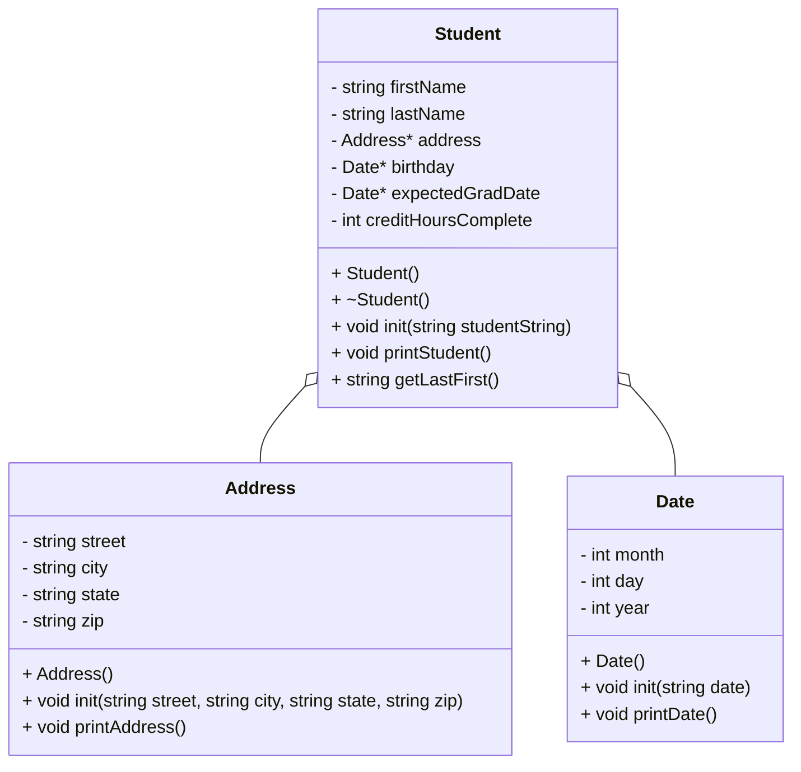

# Code Documentation for studentHeap

# Documentation of Algorithm
Just a quick note, I am breaking up certain features of the algorithm—such as creating the vector of all the students from the file—into their own functions. This is partially for readability, but also because I simply think it makes sense.

## Main Function
This is the main algorithm of the program, containing the list of students, as well as the interface for the user.
### Algorithm for Main()
    Create the vector containing the students using the readStudentFile() function
