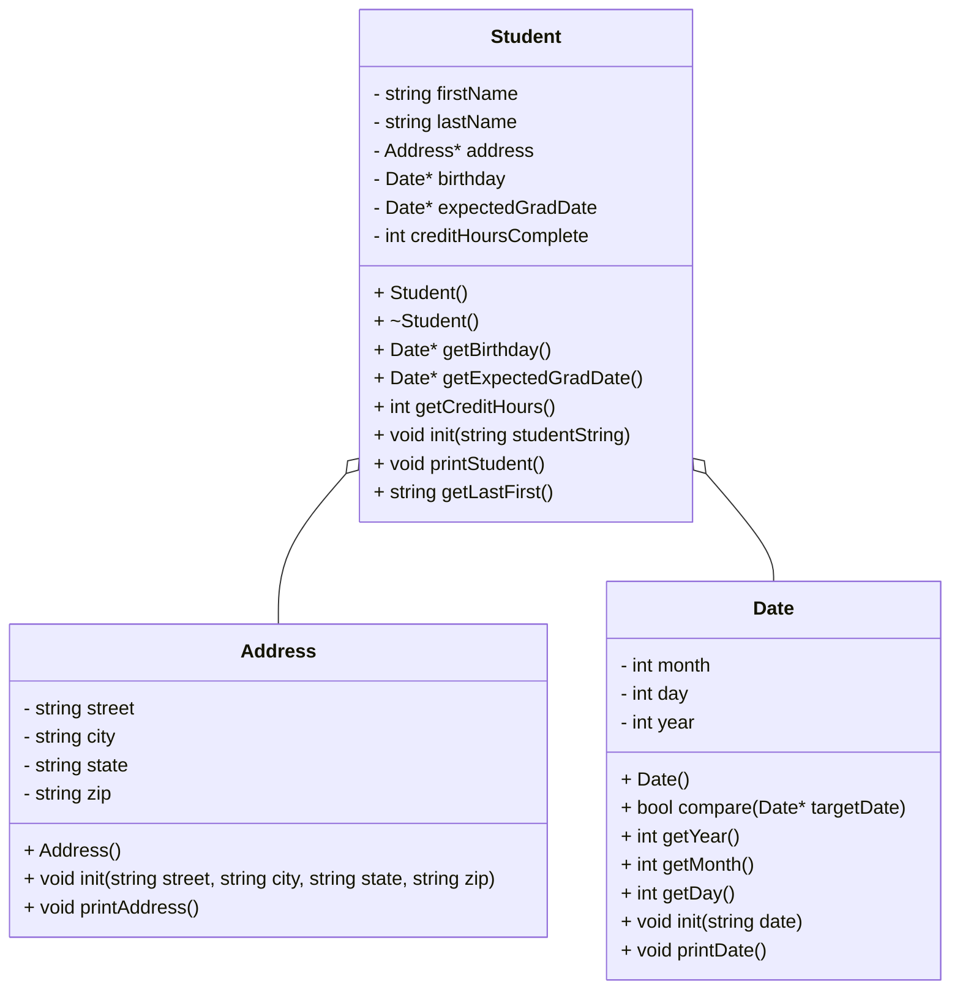

# Code Documentation for studentHeap

# Documentation of Algorithm
Just a quick note, I am breaking up certain features of the algorithm—such as creating the vector of all the students from the file—into their own functions. This is partially for readability, but also because I simply think it makes sense.  

## main Function
This is the main algorithm of the program, containing the list of students, as well as the interface for the user.  
### Algorithm for main()
    Create the vector containing the students using the readStudentFile() function  

## loadStudents Function
This is the function that reads the students.csv file and adds all the student objects to a vector.  
### Algorithm for loadStudents()
Create a vector of student pointers called studentList  
Create an inputFileStream called inFile, which will be used for reading the students.csv file  
Create a string called currentLine, which will be used to initialize each student in the vector  
Open the students.csv file via inFile  
Loop through every line in students.csv, setting currentLine to match the currently accessed line in the file, while also doing the following for each line:  
    Create a new student object on the heap, saving the pointer to it in a variable called currentStudent  
    Call init on currentStudent, using currentLine as the string for the initialization  
    Add the pointer to currentStudent to the end of the studentList vector  
After the loop is finished, return studentList  

## printStudents Function
This function prints the students vector to the console  
### Parameters for printStudents()
A vector of Student pointers (likely the vector created from students.csv), which will be referred to as students  
### Algorithm for printStudents()
Loop through each Student in the students vector, doing the following:  
    Call printStudent() on the current Student in the loop  
    Print a horizontal line to the console to clearly seperate students on viewing  

## printStudentNames Function
This function is similar to printStudents(), but instead of printing everything about the student, it only prints their names. Specifically, ir prints their last name, then their first.  
### Parameters for printStudentNames()
A vector of Student pointers (likely the vector created from students.csv), which will be referred to as students  
### Algorithm for printStudentNames()
Loop through each Student in the students vector, doing the following:  
    Print the result of the Student's getLastFirst() function to the console  

## findStudent Function
This function asks the user for the last name of a student they are looking for (it could even be a single letter, it will still work), it then returns the data of every student who's last name contains the given string.  
### Parameters for findStudent()
A vector of Student pointers (likely the vector created from students.csv), which will be referred to as students  
### Algorithm for findStudent()
Create a vector of student pointers called foundStudents (this will be the list of students printed to the console)    
Create a stringstream called converter  
Create a string called seachName which will be the name to look for  
Ask the user what last name to look for  
Loop through every student in the students vector, doing the following:  
    Set converter's string to the returned string from getLastFirst()  
    Use getline to grab the student's last name from converter  
    Compare the last name to the value of searchName, if searchName is found within the last name then add the pointer to the current student to foundStudents  
Call printStudents(), passing foundStudents as it's vector parameter 

## deleteStudents Function
This function deallocates the heap memory used for the students vector once the program is finished.  
### Parameters for deleteStudents()
A reference to the students vector (needs to be a reference so it can actually change the values in students)  
### Algorithm for deleteStudents()
Loop through each Student pointer in the students vector, doing the following:  
    Delete the current student via it's pointer

## menu Function
This function is the menu that the user interacts with.  
### Parameters for menu()
A vector of Student pointers (likely the vector created from students.csv), which will be referred to as students.  
### Algorithm for menu()
Begin a loop for the menu, which will stop when the user decides to quit  
Print out the different valid inputs the user can do (these are in the form of numbers corresponding to commands, but for this documentation i will be using the actual names for the commands rather than the numbers)  
Depending on what the user inputs, do one of the following:  
    Quit:  
        Tell the loop to stop, exiting the menu  
    Print all student names:  
        Call printStudentnames()  
    Print all student data:  
        Call printStudents()  
    Find a student:  
        Call findStudent()  
After the loop has ended, before the program ends, call deleteStudents() to deallocate heap memory, preventing memory leaks  

## sortStudents Function
This function asks the user what metric they want to sort the students by, then sorts them by said metric.  
### Parameters for sortStudents()
A reference to the student vector (must be a reference so it can actually change the values in students)  
### Algorithm for sortStudents()
Begin a loop for a menu, which will stop when the user chooses a metric to sort by  
Print out the different valid inputs the user can do (these are in the form of numbers corresponding to different sorting metrics), but for this documentation i will be using the actual names for the metrics  
Depending on what the user inputs, do one of the following:  
    Names:  
        Call the sort function, which will sort the students by name  
    Birthday:  
        Call the sort function, which will sort the students by birthday  
    Graduation date:  
        Call the sort function, which will sort the students by expected graduation date  
    Credit hours:  
        Call the sort function, which will sort the students by credit hours  
