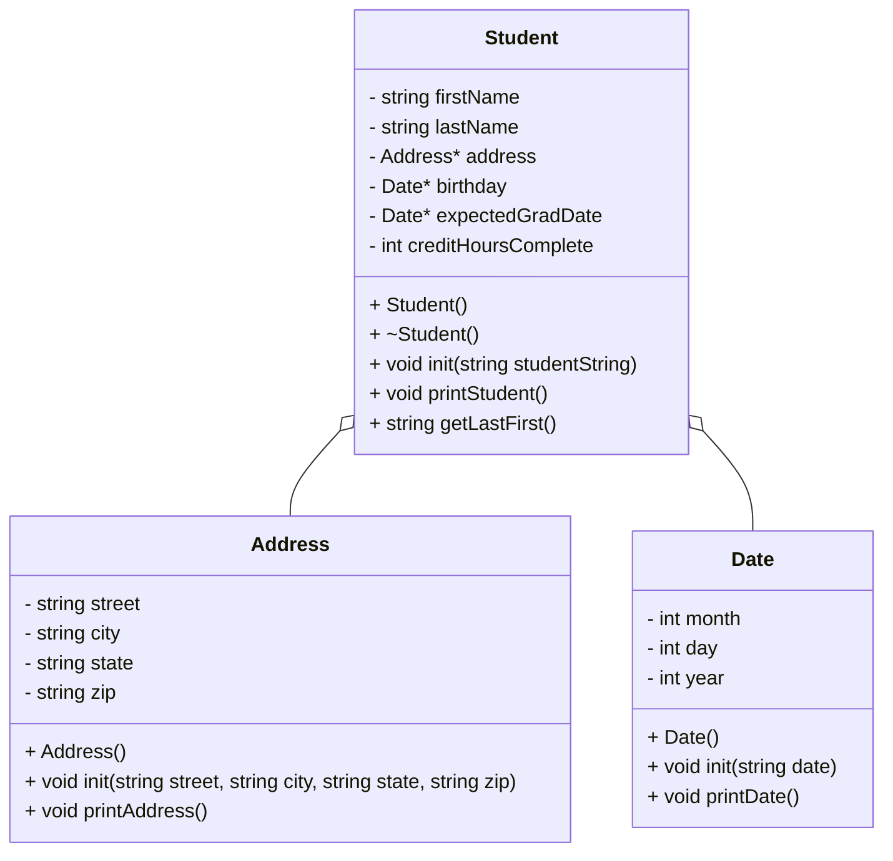

# Code Documentation for studentHeap

```mermaid
classDiagram

    class Address {    
        - string street
        - string city
        - string state
        - string zip

        + Address()
        + void init(string street, string city, string state, string zip)
        + void printAddress()
    }

    class Date {
        - int month
        - int day
        - int year

        + Date()
        + void init(string date)
        + void printDate()
    }

    class Student {
        - string firstName
        - string lastName
        - Address* address
        - Date* birthday
        - Date* expectedGradDate
        - int creditHoursComplete

        + Student()
        + ~Student()
        + void init(string studentString)
        + void printStudent()
        + string getLastFirst() 
    }

    Student o-- Address
    Student o-- Date

```
