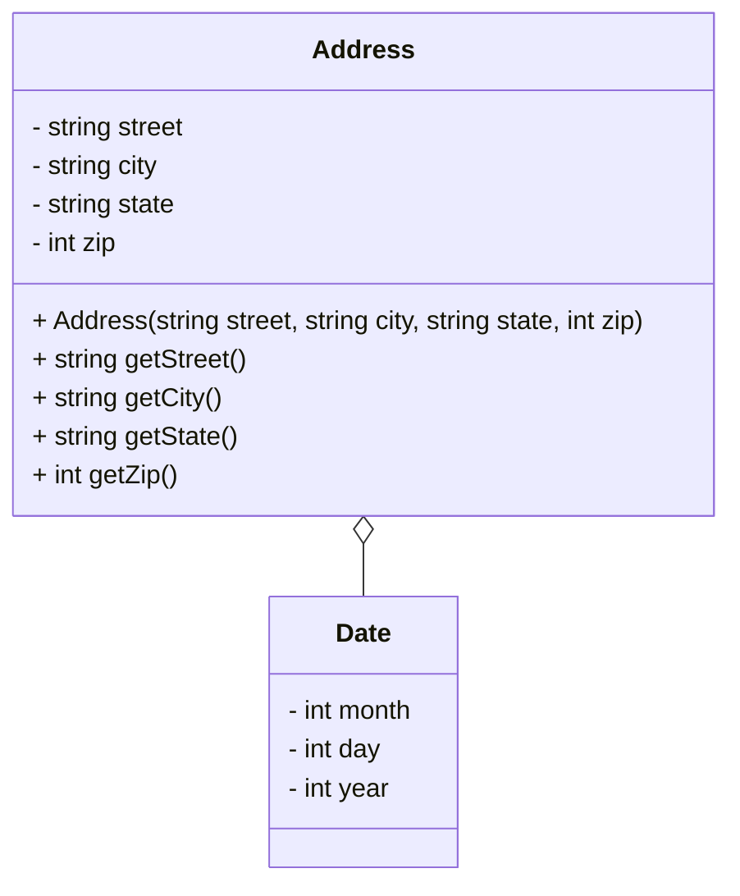

# Code Documentation for studentHeap

```mermaid
classDiagram

    class Address {    
        - string street
        - string city
        - string state
        - int zip

        + Address(string street, string city, string state, int zip)
        + string getStreet()
        + string getCity()
        + string getState()
        + int getZip()
    }

    class Date {
        - int month
        - int day
        - int year
    }

    Address o-- Date

```
