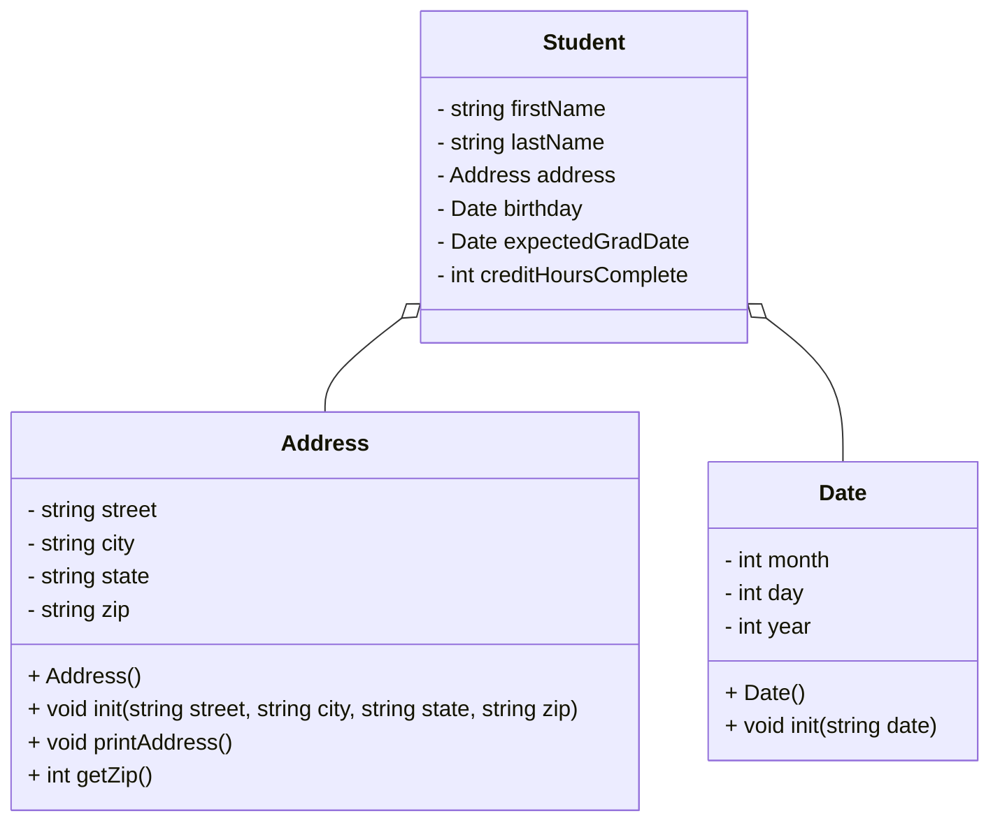

# Code Documentation for studentHeap

```mermaid
classDiagram

    class Address {    
        - string street
        - string city
        - string state
        - string zip

        + Address()
        + void init(string street, string city, string state, string zip)
        + void printAddress()
        + int getZip()
    }

    class Date {
        - int month
        - int day
        - int year

        + Date()
        + void init(string date)
    }

    class Student {
        - string firstName
        - string lastName
        - Address address
        - Date birthday
        - Date expectedGradDate
        - int creditHoursComplete
    }

    Student o-- Address
    Student o-- Date

```
